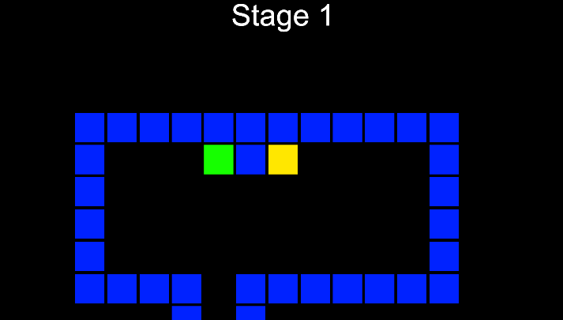

# Wall Move - 11조 이진우
내일 배움캠프 심화 주차 개인 프로젝트 + 미로 탈출 게임

## 🖥️ 프로젝트 소개
벽을 따라 움직이는 블럭을 조정하여 미로를 탈출하는 게임이다. 중간에 힌트 블럭을 통해 쉽게 출구로 향할 수 있다.
 

## 🕰️ 개발 기간
* 24.02.21일 - 24.02.22일

### ⚙️ 개발 환경
- `Unity 2022.3.2f`

## 📌 주요 기능
#### 시작화면
- Touch To Start 버튼 (게임 시작)
- Parallax 배경

#### 게임 화면
- 상하좌우로 움직이는 Player
- 화면 상단 스테이지 표시 (스크립트 추가 예정)
- 출구로 쉽게 향하도록하는 힌트 블록 (GREEN)
- 닿으면 클리어하는 출구 블록 (RED)
- 출구 블록과 플레이어가 충돌하면 클리어 판넬 출력

#### Clear 화면 
- Stage를 추가 구현하면 다음 스테이지로 넘어갈 버튼 추가 예정
